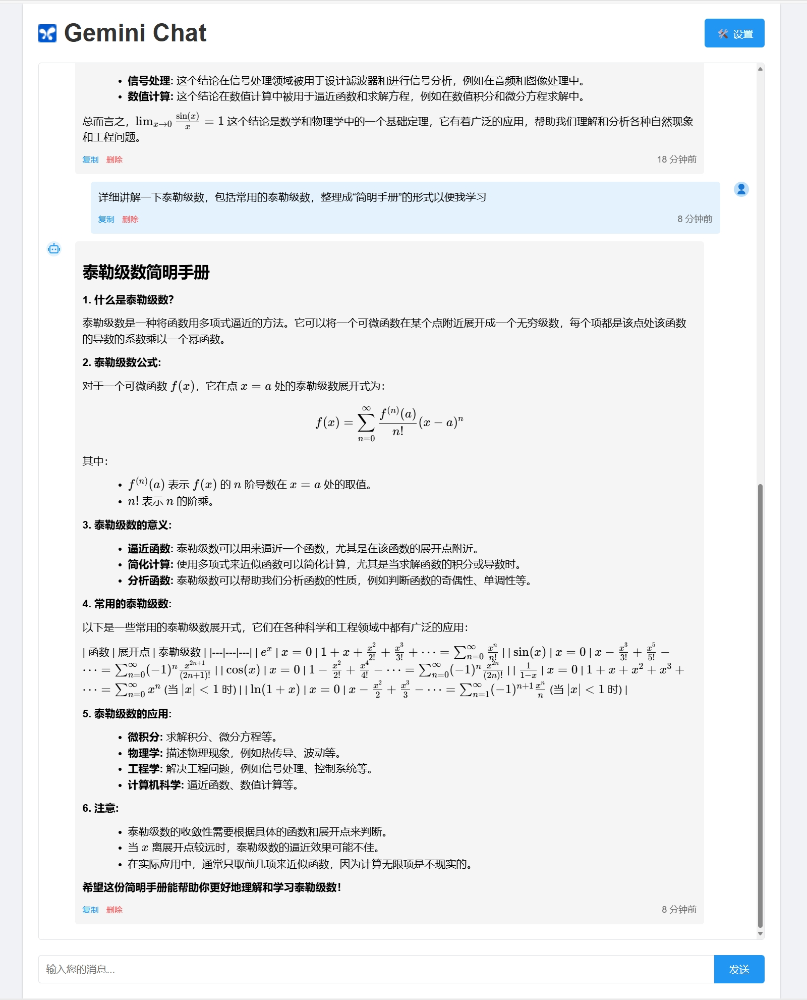

# Gemini Chat Web Application

这是一个基于 React 的 Gemini AI 聊天应用程序。它允许用户与 Gemini AI 模型进行对话，支持 Markdown 渲染、数学公式显示和代码高亮。

## 功能特点

- 与 Gemini AI 模型进行实时对话
- 支持 Markdown 渲染
- 支持数学公式显示（使用 KaTeX）
- 代码块语法高亮
- 消息历史保存和加载
- 可自定义 API 密钥
- 响应式设计，适配不同设备

## 安装

1. 克隆仓库：
   ```
   git clone https://github.com/tufeiping/gemini-web
   cd gemini-web
   ```

2. 安装依赖：
   ```
   npm install
   ```

## 运行

在开发模式下运行应用：

```
npm start
```

在生产模式下构建应用：
```
npm run build
```

然后可以部署到任何静态文件服务器上。


